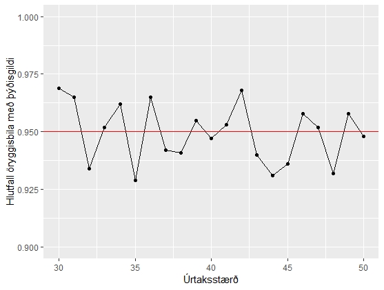

---
output:
  pdf_document: default
  html_document: default
  word_document: default
---
# Hlutföll

## Ályktanir um hlutföll

Þegar við vinnum með flokkabreytur (og að einhverju leyti raðbreytur) erum við oft og iðulega að nota talningar, hlutföll og prósentur. Í þeim tilvikum sem við erum að nota úrtök er markmiðið okkar að geta sagt til um hlutföll í þýði. 

Markmiðið er semsagt að geta ályktað eitthvað um hlutföll í þýði út frá þeim upplýsingum sem við erum með í úrtakinu. 

Það sem við viljum geta gert er að meta hlutfall p einhvers einkennis í stóru þýði.  

Dæmi: Atvinnuleysi, hverjir ætla að kjósa hvern,  

 
1. Við veljum SRS af stærð n úr þýðinu 
2. Skráum hjá okkur talningu X fyrir öll successes í úrtakinu
3. Successess í þessu tilviki stendur fyrir hvert það tilvik þar sem einkennið kemur fram
   * Algengt er að gera þetta á formi tvíkosta breytu (binary eða dichotomous) þar sem 1 stendur fyrir success en 0 stendur fyrir ekki success 
   * Kosturinn við þetta er að þá er hægt að reikna meðaltal á breytunni og þá verður niðurstaðan hlutfall þeirra sem eru með einkennið sem leitað var eftir. 

Tölfræðilega séð erum við að álykta um líkurnar $p$ tilteknum atburði innan tvíliðudreifingarinnar (*inference about the probability p of a success in the binomial setting*). 

Hlutfall atburðarins í úrtakinu ($\hat{p}=X/n$ er mat á hinu óþekkta þýðishlutfalli $p$ - við notum semsagt p-hattur ($\hat{p}$) fyrir úrtaksmatið á þýðisstikanum $p$. Ef þýðið er miklu stærra en úrtakið (að minnsta kosti 20 sinnum stærra) þá mun talningin X hafa nokkurn veginn tíliðudreifingu (*binomial distribution*),  B(n,p). 

Þegar úrtakið er mjög lítið þá verðum við að vinna með tvíliðudreifinguna hvað varðar meðaltal og öryggisbil fyrir $p$. En þegar úrtökin eru stór þá er bæði talningin X og úrtakshlutfallið $\hat{p}$ nokkurnveginn normaldreifð. Við munum aðeins skoða ályktanir sem byggja á normaldreifingu.  

## Tvíliðudreifingin

Tvíluðdreifingin er strjál líkindadreifing (*discrete probability distribution*) þar sem dregnar eru upp fjöldi atburða í röð óháðra tilrauna þar sem spurt er er tvíkosta spurningar (já/nei). Hver og ein þessara tilrauna er kölluð Bernoulli trial eða Bernoulli tilraun og því er röð slíkra tilrauna kölluð Bernoulli process.

Tvíliðudreifingin er oft notuð til að setja upp líkan fyrir fjölda atburða í úrtaki af stærðinni $n$ sem er dregið með skilum úr þýði af stærðinni N. Tæknilega séð ætti maður ekki að nota tvíliðudreifinguna ef um er að ræða úrtök sem eru án skila (þá kemur út hypergeometric dreifing) - en hins vegar þegar N er miklu stærra en n þá er tvíliðudreifingin nokkuð góð nálgun fyrir gögn af þessari tegund.

Á mynd \@ref(fig:binomplot) má sjá sex stöplarit með mismunandi stikum tvíliðudreifingarinnar; annars vegar eru úrtökin af stærðinni 10 eða 40 og hlutföllin í þýðinu eru 0,1, 0,5, 0,85 eða 0,99. Á þessum myndum má sjá ýmislegt mikilvægt. Í fyrsta lagi má sjá að þegar úrtökin eru stærri (n=40) þá er dreifingin mun nær normal heldur en þegar um er að ræða lítið úrtök (n=10). Í öðru lagi má sjá að dreifingin hefur tilhneingu til að vera skekktari eftir því sem þýðishlutfallið ($p$) er nær annað hvort 0 eða 1. Þegar við lesum úr myndunum sjá við hvernig mismunandi úrtök úr sama þýði myndu hegða sér undir tvíliðudreifingunni. Þannig sjáum við að efsta stöplaritinu til vinstri á myndinni eru stærstu súlurnar á eða í kringum gildið 1. Það þýðir að í ítrekuðum úrtökum, þá munu flest úrtök skila einu tilviki í úrtakinu sem tvíkostabreytan gefur okkur 1, en 9 tilvikum þar sem tvíkostabreytan er 0. Það er vegna þess að þýðishlutfallið er 0,1 - sem merkir að 1 af hverjum 10 er með tvískostagildið 1, aðrir eru með 0. Þess vegna munum við, í endurteknum úrtökum fá úrtaksgildi p sem 0,1.  

```{r, echo = FALSE, warning=FALSE, message=FALSE, binomplot, fig.cap = "Átta mismunandi stöplarit tvíliðudreifingar"}

n <- 10
P <- 0.1
data1 <- dbinom(x=0:n,size=n, prob=P)
names(data1) <- 0:n

n <- 40
P <- 0.1
data2 <- dbinom(x=0:n,size=n, prob=P)
names(data2) <- 0:n

n <- 10
P <- 0.50
data3 <- dbinom(x=0:n,size=n, prob=P)
names(data3) <- 0:n

n <- 40
P <- 0.50
data4 <- dbinom(x=0:n,size=n, prob=P)
names(data4) <- 0:n

n <- 10
P <- 0.85
data5 <- dbinom(x=0:n,size=n, prob=P)
names(data5) <- 0:n

n <- 40
P <- 0.85
data6 <- dbinom(x=0:n,size=n, prob=P)
names(data6) <- 0:n

n <- 10
P <- 0.99
data7 <- dbinom(x=0:n,size=n, prob=P)
names(data7) <- 0:n

n <- 40
P <- 0.99
data8 <- dbinom(x=0:n,size=n, prob=P)
names(data8) <- 0:n

par(mfrow=c(2,4))
barplot(data1, main="n=10; P=0,1", ylim = c(0,0.4))
barplot(data2, main="n=40; P=0,1", ylim = c(0,0.4))
barplot(data3, main="n=10; P=0,50", ylim = c(0,0.4))
barplot(data4, main="n=40; P=0,50", ylim = c(0,0.4))
barplot(data5, main="n=10; P=0,85", ylim = c(0,0.4))
barplot(data6, main="n=40; P=0,85", ylim = c(0,0.4))
barplot(data5, main="n=10; P=0,99", ylim = c(0,0.4))
barplot(data6, main="n=40; P=0,99", ylim = c(0,0.4))
par(mfrow=c(1,1))

```

### Dæmi

Ef við ætlum að kasta upp krónu þá viljum við vita hvort krónan sé lögleg eða hvort einhver hafi átt við hana, þá getum við kastað henni 10 sinnum, talið í hvert sinn sem við fáum upp bergrisann (1) og í hvert sinn við fáum síldina (0) og athugað að hvaða marki sú dreifing sem við fáum víkur frá tvíliðudreifingunni. Þessa dreifingu sjáum við á mynd \@ref(fig:binomplot), í þriðja stöplariti frá vinstri í efri hluta myndarinnar. Þar sjáum við að við myndum gera ráð fyrir því að við ættum að fá bergrisann í helmingi tilvika, eða 5 sinnum enda bendir dreifingin til þess að það ætti að gerast í um 25% tilvika ef slík tilraun yrði gerð ítrekað. En hins vegar sjáum við að það ætti ekki að vera einkennilegt að fá annað hvort 4 sinnum eða 6 sinnum bergrisann þegar allt er með felldu með krónuna okkar, þar sem í um 20% tilvika myndum við fá 4 sinnum bergrisa og sama hlutfall fyrir sex bergrisa, samkvæmt tíliðudreifingunni. Þannig sjáum við að í um 65% tilvika myndum við fá 4 - 6 bergrisa yfir ítrekaðar tilraunir. Það er í sjálfu sér ekki skrítið. Hins vegar er ef við myndum aðeins fá 1 bergrisa yfir 10 tilraunir, þá er það mjög ólíklegt - en svo sem ekki alveg út úr kortinu. Þá er bara spurning hvert viðmið okkar á að vera til að við séum nægilega viss um að ekki sé búið að eiga við krónuna.

## Ályktanir um eitt hlutfall

Þegar við erum með stórt úrtak og ætlum að álykta um hlutfall í þýði. 

* Við metum hið óþekkta þýðishlutfall $p$ með því að reikna úrtakshlutfallið $\hat{p}$ =X/n 
* það er, hlutfallið er fjöldi tilvika þar sem eiginleikinn sem við erum að leita eftir kemur upp (það sem kaninn kallar "number of successes) á móti fjölda í úrtaki. 
* til dæmis ef við erum með 1000 manna úrtak og 20 eru atvinnulausir þá er þetta reiknað sem: $\hat{p}$ = 20/1000 = 0,02 
* ef við erum með úrtak 40 manna og 20 eru með háskólagráðu þá reiknum við þetta sem 20/40=0,5 

Ef úrtakið er nægilega stórt þá er úrtakadreifingin nokkurn veginn normal með meðaltalið:
$\mu_\hat{p} = p$
og staðalfrávikið
$\sigma_\hat{p}=\sqrt{\frac{p(1-p)}{n}}$

Ef höldum áfram með dæmin okkar þá er 

* meðaltal úrtakadreifingarinnar 0,02 og staðalfrávik hennar = 0,004427189 fyrir atvinnuleysi 
* meðaltal úrtakadreifingarinnar 0,50 og staðalfrávik hennar = 0,07905694 fyrir menntun 

Ef um er að ræða nógu stórt úrtak þá verður um það bil 95% skiptanna verður $\hat{p}$ innan
$\sqrt{\frac{p(1-p)}{n}}$ 

Og aftur með dæmunum okkar: 

* tvö staðalfrávik til og frá fyrir atvinnuleysi = +/- 0,008854377 
* tvö staðalfrávik til og frá fyrir háskólamenntun = +/- 0,1581139 

Staðalfrávikið ($\sigma_\hat{p}$) veltur á hinum óþekkta stika $p$. Til að meta þetta staðalfrávik með gögnunum þá skiptum við út $p$ með $\hat{p}$ í formúlunni. Hér er hugtakið staðalvilla notað fyrir staðfrávik tölugildis sem er metið út frá gögnum.

## Öryggisbil

Þegar við erum að vinna með stórt úrtak en viljum finna öryggisbil fyrir hlutfall í þýði. Step-by-step.

Þetta öryggisbil er kallað Wald öryggisbil þar sem það byggir á Wald prófinu sem er notað fyrir stór tvíliðutilvik.

1. Valið SRS af stærðinni n úr stóru þýði þar sem eru óþekkt hlutfall af eiginleikanum sem við erum á höttunum eftir (successess). Við reiknum hlutfall eiginleikans í úrtaki sem  $\hat{p}=\frac{X}{n}$ þar sem X er hlutfall eiginleikans sem við mældum í úrtakinu.
2. Staðalvillan fyrir $\hat{p}$ p-hatt er $SE_\hat{p}=\sqrt{\frac{\hat{p}(1-\hat{p})}{n}}$
3. Skekkjumörk (*margins of error*) fyrir öryggisstig C er $m=z*SE_\hat{p}$ þar sem höfnunarmarkið (*critical value*) z* er gildi fyrir normaldreifða þéttleikakúrvu með svæðið C milli -z* og z*.
4. Öryggisbil C fyrir $p$ er $\hat{p}\pm m$
5. Hægt er að nota eftirfarandi bil 

* Fyrir 90% þá er z*= 1,645 
* Fyrir 95% þá er z*= 1,96 
* Fyrir 99% þá er z*= 2,576 

6. Þessi tölugildi má nota þegar um er að ræða úrtak þar sem bæði fjöldi með eiginleikann okkar (successess) og fjöldi þeirra sem eru ekki með eiginleikann okkar eru báðir að lágmarki 10. Það er, fyrir tvíkostabreytu viljum við að lágmarki 10 hafi gildið 1 og að lágmarki 10 hafi gildið 0.

### Dæmi

#### Atvinnuleysi 

* Úrtakshlutfallið: 0,02 
* Staðalvillan: 0,004427189 
* Skekkjumörk: 
    * 90%: 0,007282725 
    * 95%: 0,00867729 
    * 99%: 0,01140444 
* Öryggisbil:
    * 90%: 0,013 - 0,027 
        * 1,3 - 2,7% þýðisins eru atvinnulaus
    * 95%: 0,011 - 0,029
        * 1,1 - 2,9% þýðisins eru atvinnulaus
    * 99%: 0,0086 - 0,031
        * 0,9 - 3,1% þýðisins eru atvinnulaus 

#### Menntun 

* Úrtakshlutfallið: 0,50
* Staðalvillan: 0,07905694 
* Skekkjumörk: 
    * 90%: 0,1300487
    * 95%: 0,1549516
    * 99%: 0,2036507 
* Öryggisbil:
    * 90%: 0,37 - 0,63 
        * 37 - 63% þýðisins hafa lokið háskólamenntun
    * 95%: 0,345 - 0,655
        * 34,5 - 65,5% þýðisins hafa lokið háskólamenntun
    * 99%: 0,296 - 0,701
        * 29,6 - 70,1% þýðisins hafa lokið háskólamenntun 

### Túlkun öryggisbils

Við getum sagt með 95% vissu að milli [lægri mörk] og [hærri mörk] hópsins í þýðinu er með eiginleikann sem við erum að mæla. 

Til dæmis: við getum sagt með 95% vissu að milli 1,1 - 2,9% einstaklinga á vinnualdri í þýðinu (NB - þarna fer að kikka inn hvernig við skilgreinum target þýði rannsóknarinnar) séu atvinnulausir. 

Eða: við getum sagt með 95% vissu að milli 34,5 - 65,5% einstaklinga í þýði rannsóknarinnar hafa lokið námi á háskólastigi. 

 - hér er spurningin: Hvað getum við gert við svona upplýsingar? Þetta er gríðarlega vítt öryggisbil og ekki ljóst að það hjálpi neitt við ákvarðanatöku eða við að auka þekkingu á þýðinu. 

Úr Hoekstra et. Al, 2014:  

>"A CI is a numerical interval constructed around the estimate of a parameter. Such an interval does not, however, directly indicate a property of the parameter; instead, it indicates a property of the procedure, as is typical for a frequentist technique. Specifically, we may find that a particular procedure, when used repeatedly across a series of hypothetical data sets (i.e., the sample space), yields intervals that contain the true parameter value in 95 % of the cases. When such a procedure is applied to a particular data set, the resulting interval is said to be a 95 % CI. The key point is that the CIs do not provide for a statement about the parameter as it relates to the particular sample at hand; instead, they provide for a statement about the performance of the procedure of drawing such intervals in repeated use. Hence, it is incorrect to interpret a CI as the probability that the true value is within the interval (e.g., Berger & Wolpert, 1988). As is the case with p-values, CIs do not allow one to make probability statements about parameters or hypotheses." 

### Öryggisbil nær aðeins utan um hluta villunnar

Milvægt er að muna að skekkjumörk í útreikningum á öryggisbilum tekur aðeins til handahófskenndrar úrtaksvillu (random sampling error) en ekki til annarra villuþátta sem kunna að hafa áhrif á niðurstöður rannsókna. Þrjár aðrar mikilvægar  villur í úrtaksrannsóknum eru: 

* Þekjuvilla: Þegar úrtaksramminn nær ekki fyllilega utan um þýðið sem við ætlum okkur að álykta um (target population). Til dæmis: Nær þjóðskrá fyllilega yfir alla sem búa á Íslandi? 
* Ofþekja: Hvað með þá sem eru fluttir af landinu en eru enn skráðir í þjóðskrá? 
* Vanþekja: En þeir sem eru á landinu en eru einhverra hluta vegna ekki skráðir? 
* Brottfallsvilla: Þegar ekki tekst að fá gildi fyrir alla sem eru valdir í úrtakið. Til dæmis ef einhver neitar þátttöku. 
    * Unit nonresponse: Þegar ekki tekst að fá neitt nothæft svar frá einni tiltekinni úrtakseiningu 
    * Item nonresponse: Þegar viðkomandi úrtakseining svarar ekki tilteknu atriði viðkomandi lista 
* Mælivilla: Þegar mælingin er ekki í samræmi við raunverulegar aðstæður. Til dæmis ef viðkomandi skilur ekki spurninguna og svarar út í hött eða svarar röð spurninga með að merkja alltaf við mjög sammála án þess að það sé til marks um hans rétta viðhorf. 

Aðrar villur eru til dæmis processing error og úrvinnsluvilla (þar á milli vigtunarvilla). 

Total survey error eru þau fræði sem fást við að takmarka áhrif allra þessara áhrif á niðurstöður úrtaksrannsókna og ekki síst hvað varðar tradeoff milli mismunandi villuþátta. Til dæmis gæti verið að mixed-mode könnun (vefur og sími) geti aukið þátttöku ákveðinna hópa (og þar með dregið úr brottfallsvillu) en hugsanlega er erfiðara að svara spurningum könnunarinnar á vefnum og þá gæti mælivilla orðið meira vandamál heldur en þegar aðeins var um að ræða gagnasöfnun í gegnum síma. 

### Plús fjórir öryggisbil

Hermirannsóknir hafa bent til þess að öryggisbil sem byggð er á aðferð stórra úrtaka (þ.e. aðferðin sem við erum búin að vera að skoða) getur verið mjög ónákvæm þegar um er að ræða litla hópa - það er, þegar fjöldi þeirra sem eru með einkennið í úrtaki og þeirra sem eru ekki með viðkomandi einkenni eru hvor um sig minni en 10. 

 

Þegar þetta gerist er hægt að beita einfaldri leiðréttingu í praktískum aðstæðum sem virkar prýðilega. Leiðréttingin byggir á því að bæta við tveimur mælingum með viðkomandi einkenni og tveimur án þeirra  í formúluna - það er, að ganga úr frá því að það hafi í raun verið fjórar fleiri mælingar í úrtakinu. Þá verður matið á hlutfalli í þýðinu svohljóðandi: $\tilde{p}=\frac{X+2}{n+4}$

Þessi leiðrétting kemur fyrst fram hjá Wilson árið 1927 og hún er stundum nefnd Agresti-Coull bilið (Agresti-Coull interval). Bókarhöfundar kalla þessa aðferð "the plus four estimate". Öryggisilið er fenigð út með að fyrst staðla Agresti-Coull stikamatið og reiknað sem z-gildi. 

#### Dæmi

Við erum með fámennt úrtak eldra fólks. Þar af erum við með 7 einstaklinga sem eru metnir með lélega hugræna getu OG eru yngri en 75 ára en í heildina eru 66 á þessum aldri í úrtakinu. Til að geta hjálpað hinu opinbera við að skipuleggja þjónustu við aldraða og vita hversu mikla fjármuni þarf til þess þá þurfum við að hjálpa til við að segja hversu margir aldraðir með lélega hugræna getu eru í þýðinu. Þar sem við erum með færri en 7 í úrtakinu er rétt að nota Agresti-Coull bilið við að reikna öryggisbilið. 

1. $\tilde{p}=\frac{X+2}{n+4}$ Í okkar tilviki er þetta $\tilde{p}=\frac{7+2}{66+4}$ eða $\tilde{p}=0.1286$
2. Þá reiknum við staðalvilluna: $SE_\tilde{p}=\sqrt{\frac{\tilde{p}(1-\tilde{p})}{n+4}}$ sem gefur okkur $SE_\tilde{p}=0.0598$
3. Skekkjumörk: 
    $m=z*SE_\tilde{p}$
    sem er:

    * 90%: 0,06581199 
    * 95%: 0,07841428 
    * 99%: 0,1030588 

4. Þá getum við reiknað öryggisbilin: 

    * 90%: 0,0628 - 0.194
        * Með 90% vissu getum við sagt að á bilinu  6,3 - 19,4% eldra fólks undir 75 ára aldri sé með léglea hugræna getu
    * 95%: 0.051 - 0.207
        * Með 95% vissu getum við sagt að á bilinu  5,1 - 20,7% eldra fólks undir 75 ára aldri sé með léglea hugræna getu
    * 99%: 0.026 - 0.232
        * Með 99% vissu getum við sagt að á bilinu  2,6 - 23,2% eldra fólks undir 75 ára aldri sé með léglea hugræna getu 

Ef við miðum við að þetta hafi verið úrtak tekið á Íslandi þá getum við miðað við reiknað fjölda eldri borgara yfir síðustu ár til að sjá hversu margir í heildina má reikna með að séu með laka hugræna getu í þessum aldurshópi í þýðinu. 

Samkvæmt tölum frá Hagstofu Íslands voru 21.683 einstaklingar 67 ára og eldri búsettir á landinu árið 2018. Samkvæmt okkar útreikningum má því búast við að á bilinu 2500 - 3000 einstaklingar á þessum aldri séu með laka hugræna getu (2568 - 3005), samkvæmt 95% öryggisbili.   

Svo er auðvitað áhugavert að skoða hver er munurinn á ályktun okkar með Agresti-Coull bilinu og hefðbundnum öryggisbilsútreikningum:

* $\hat{p}=0.106$ eða 10,6%
    * 90%: 0.0437 - 0.168
        * Með 90% vissu getum við sagt að á bilinu  4,4 - 16,8% eldra fólks undir 75 ára aldri sé með léglega hugræna getu
    * 95%: 0.0318 - 0.180
        * Með 95% vissu getum við sagt að á bilinu  3,2 - 18% eldra fólks undir 75 ára aldri sé með léglega hugræna getu
    * 99%: 0.0084 - 0.204
        * Með 99% vissu getum við sagt að á bilinu  0,8 - 20,4% eldra fólks undir 75 ára aldri sé með léglega hugræna getu

## Marktektarpróf

Við getum líka reiknað marktektarpróf til að meta hvort hlutfallið sem við höfum metið sé hið eina sanna í úrtakinu. Þá erum við að prófa núlltilgátuna að þýðisgildið sé eitthvað ákveðið gildi (til dæmis 0,5) og hvort úrtaksgildið víki nægilega mikið frá því til að hægt sé að tala um marktækan mun - og þá þannig að þýðisgildið sé líklega eitthvað annað en það sem var lagt upp með.  

Til dæmis getum við spurt okkur hvort við getum verið viss um að hlutfall eldra fólks á aldrinum 67 - 74 með hugræn vandamál sé lægra en 0,25.  

$z=\frac{\hat{p}-p_0}{\sqrt{\frac{p_0(1-p_0)}{n}}}$

Þar sem $p_0$ er viðmiðunargildið, $n$ er heildarfjöldi í úrtaki og $\hat{p}$ er matið á hlutallinu í þýðinu. Til að reikna út z-gildið þurfum við að fylla inn í þessa formúlu og svo fletta upp viðeigandi vendigildi í normaldreifingartöflu. 

$z=\frac{0.106-0.25}{\sqrt{\frac{0.25(1-0.25)}{66}}}$

Í þessu tilviki fáum við p-gildið `r 2*pnorm(-abs(-2.70168))` fyrir z-gildið -2,70168; og í þessu tilviki erum við með einhliða tilgátu og þess vegna notum við einhliða p-gildi.  

Í þessu tilviki fáum við marktækan mun - að öllum líkinum er hlutfall eldra fólks á aldrinum 65 - 74 ára með hugræn vandamál lægra en 25% í mannfjöldanum. 

Hins vegar er það afar sjaldgæft að vera í þeim aðstæðum að vilja reikna marktektarpróf fyrir eitt hlutfall - þar sem við erum sjaldnast með eitthvað eitt gildi sem við viljum reikna mun á við úrtakshlutfallið okkar. Það er, við erum eiginlega aldrei með nákvæmt $p0$ gildi sem við viljum nota í útreikningum okkar. 

## Val á úrtaki út frá öryggisbili

Þegar rannsóknir eru skipulagðar er eðlilegt að huga að því hversu mikla nákvæmni við viljum í öryggisbilið. Það er, með hversu mikilli vissu viljum við getað ályktað um aðstæður í þýði. Ef við skoðum formúluna fyrir öryggisbil hlutfalls þá sjáum við að úrtaksstærðin hefur áhrif á vídd öryggisbilsins. Við vitum hins vegar ekki gildi stikans sem við ætlum að meta með úrtaksrannsókninni. Þess vegna giskum við á skynsamleg gildi, til dæmis úr eldri rannsóknum eða beitum sérfræðiþekkingu til þess. Með því þá tryggjum við (að því marki sem ágiskanir okkur eru skynsamlegar) að úrtaksstærðin leyfi nákvæma ályktunartöku á grundvelli úrtaksins um aðstæður í þýði. 
Við getum beitt eftirfarandi formúlu til að taka ákvörðun um fjölda í úrtaki: 

$n=(\frac{z^*}{m})^2 p^*(1-p^*)$ 

Þar sem z* er vendigildi fyrir öryggisstig C og p* er ágiskað gildi fyrir hlutfall eiginleikans í framtíðarúrtökum.  

Þegar p* er nærri 0,5 þá er gildi n frekar ónæmt fyrir vali á p* - ef hins vegar gildi p er talið vera lægra en 0,3 eða hærra en 0,7 þá getur val á p=0,5 skilað miklu stærra úrtaki en þörf er fyrir. Dæmi um þetta má sjá á mynd \@ref(fig:urtaksplot).

```{r, echo = FALSE, warning=FALSE, message=FALSE, urtaksplot, fig.cap = "Úrtaksstærðir fyrir mismunandi skekkjumörk og mismunandi þýðishlutfall "}

library(ggplot2)

n1 <- 2001
n2 <- 2000

p1 <- 0.055
p2 <- 0.029

X1 <- as.integer(p1*n1)
X2 <- as.integer(p2*n2)

D <- p1 - p2

se <- sqrt((p1*(1-p1))/n1+(p2*(1-p2))/n2)

m1 <- 1.645*se
m2 <- 1.96*se
m3 <- 2.576*se

##marktektarpróf

phat <- (X1+X2)/(n1+n2)

sedp <- sqrt(phat*(1-phat)*((1/n1)+(1/n2)))

zgildi <- (p1-p2)/sedp

#pnorm(zgildi)
zcrit = qnorm(0.975)

#tvíhliða tilgáta
#2*pnorm(1-zgildi)

###úrtaksstærð

zmerkt <- 1.96
mgildi <- 0.05

#ceiling(((zmerkt/mgildi)^2)*p1*(1-p1)+p2*(1-p2))


urtakfj <- function(x)
{
  ceiling(((zmerkt/x)^2)*0.5)
}


a <- c()
b <- c()
for(i in seq(from=10, to=50, by=1)){
  div <- i/100
  a[i] <- urtakfj(div)
  b[i] <- div
}

urtok <- as.data.frame(cbind(a,b))

names(urtok) <- c("n","m")
urtok$hlutfall <- .5

urtakfj <- function(x)
{
  ceiling(((zmerkt/x)^2)*0.25)
}


n <- c()
m <- c()
for(i in seq(from=10, to=50, by=1)){
  div <- i/100
  n[i] <- urtakfj(div)
  m[i] <- div
}

urtok2<- as.data.frame(cbind(n,m))
urtok2$hlutfall <- .25

urtok <- rbind(urtok,urtok2)
###

urtakfj <- function(x)
{
  ceiling(((zmerkt/x)^2)*0.10)
}


n <- c()
m <- c()
for(i in seq(from=10, to=50, by=1)){
  div <- i/100
  n[i] <- urtakfj(div)
  m[i] <- div
}

urtok2<- as.data.frame(cbind(n,m))
urtok2$hlutfall <- .10

urtok <- rbind(urtok,urtok2)

urtakfj <- function(x)
{
  ceiling(((zmerkt/x)^2)*0.05)
}


n <- c()
m <- c()
for(i in seq(from=10, to=50, by=1)){
  div <- i/100
  n[i] <- urtakfj(div)
  m[i] <- div
}

urtok2<- as.data.frame(cbind(n,m))
urtok2$hlutfall <- .05

urtok <- rbind(urtok,urtok2)


p <- ggplot(urtok, aes(m, n))
p + geom_line(aes(colour = factor(hlutfall))) +
  geom_point(aes(colour = factor(hlutfall))) +
  scale_y_continuous(name="Úrtaksstærð") +
  scale_x_continuous(name="Margins of error") +
  scale_fill_discrete(name = "Þýðishlutfall") +
  labs(color='Þýðishlutfall') 
```


### Dæmi

Ef við ætlum að geta sagt til um atvinnuleysi í þýðinu með 95% vissu þannig að öryggisbilið nær aðeins 2% í kringum stikamatið þá myndum við fá eftirfarandi niðurstöðu (**muna alltaf að námunda upp** - annars fáum við aðeins hærri skekkjumörk en við lögðum upp með): 

 * ef við miðum við að atvinnuleysi sé um 5% í þýðinu; n=457
    * $n=(\frac{1.96}{0.02})^2 0.05(1-0.05)$ 
 * ef við miðum við að atvinnuleysi sé um 20% í þýðinu; n=1537
    * $n=(\frac{1.96}{0.02})^2 0.20(1-0.20)$ 
 * við við miðum við 10% atvinnuleysi og 3% nákvæmni í kringum stikamatið; n=385 
    * $n=(\frac{1.96}{0.03})^2 0.10(1-0.10)$ 

## Tvö hlutföll

### Meðaltal og staðalfrávik

Oft höfum við það markmið að geta sagt til um hvort munur á hlutfalli tveggja hópa sé lýsing á því sem fram fer í þýðinu. Það er, getum við alhæft muninn sem við finnum í úrtakinu okkar yfir á þýðið? Við getum bæði skoðað öryggisbil í þessum tilgangi sem og reiknað marktektarpróf til að skera úr um hversu líklegt er að fá þann mun sem við sjáum í úrtakinu okkar, eða meiri mun, ef raunverulega engin munur er til staðar í þýðinu. Ef líkurnar eru lágar þá göngum við út frá því að munurinn eigi sér einnig stað í þýðinu. 

Við getum tekið dæmi. Árið 2015 framkvæmdi Hagstofa Íslands heilsufarsrannsókn á íslendingum. Meðal þess sem spurt var um í rannsókninni voru þunglyndiseinkenni sem voru flokkuð í annars vegar í væg og hins vegar í mikil. Samkvæmt niðurstöðum rannsóknarinnar voru 2,9% karla og 5,5% kvenna sem upplifðu mikil þunglyndiseinkenni þegar rannsóknin var lögð fyrir. Heildarfjöldi svarenda var 4001. Hagstofan gefur ekki upp hver er kynjaskipting svarenda en við getum gefið okkur að hún hafi verið nokkurn vegin jöfn (þó það sé hæpin forsenda í raunheimum þar sem karlar eru jafnan ólíklegri til að svara könnunum en konur) þannig að karlar í svarendahópnum hafi verið 2000 en konur 2001. 

Til að kanna hvort um sé að ræða tölfræðilega marktækan mun á hópunum þá notum við mismuninn milli hlutfallana tveggja sem við erum með í úrtakinu.  

$D=\hat{p}_1− \hat{p}_2$

Hjá okkur er þetta: 
$D = 0.055 - 0.029$

$D = 0.026$

Þegar úrtaksstærðirnar eru nógu stórar þá er hægt að ganga út frá því að úrtakadreifing D sé approximately normal. 

Fyrsta skrefið er að fá út meðaltal og staðalfrávik fyrir D. Út frá samlagningarreglu meðaltala (addition rule or means) þá er meðaltalið af D mismunur meðaltalanna. Það þýðir að D (mismunurinn milli úrtakshlutfallanna - sem við fengum út úr formúlunni hér áðan) er óbjagað mat á þýðismuninum milli hlutfallanna p1 og p2. Að sama skapi segir samlagningarreglan fyrir dreifni (addition rule for variances) að dreifni D er summan af dreifnitölunum. 

Þá er það svo að þegar n1 og n2 eru nokkuð stór, þá er D normal dreift (approximately) með meðaltalið: 

$\mu_D = \hat{p}_1 - \hat{p}_2$

og staðalfrávikið: 

$\sigma_D = \sqrt{\frac{\hat{p}_1(1-\hat{p}_1)}{n_1} + {\frac{\hat{p}_2(1-\hat{p}_2)}{n_2} } }$
 
Hjá okkur er þá meðaltalið 0,026 og staðalfrávikið 

$\sigma_D = \sqrt{\frac{=0.055(1−0.055}{2001} + {\frac{0,026(1−0,026)}{2000} } }$
$\sigma_D = 0,006216$

### Öryggisbil

Þegar við erum með nógu stórt úrtak þá getum við notað eftirfarandi. Höfum í huga að þessi aðferð virkar fyrir 90, 95 og 99% öryggismörk, þegar fjöldi successa og failures eru hvort um sig 10 eða fleiri.  

1. Veldu SRS af stærðinni $n_1$ úr stóru þýði sem er með hlutfallið $p_1$ fyrir ákveðið einkenni og annað óháð SRS úr öðru þýði af stærðinni $n_2$ þar sem hlutfall einkennisins er $p_2$. 
2. Mat þýðismuninum er: 

$D=\hat{p}_1− \hat{p}_2$

3. Staðalvillan fyrir D er reiknuð svohljóðandi : 

$\sigma_D = \sqrt{\frac{\hat{p}_1(1-\hat{p}_1)}{n_1} + {\frac{\hat{p}_2(1-\hat{p}_2)}{n_2} } }$

4. Skekkjmörk fyrir öryggisstigið C eru: 

* $m=z*SE_D$
* Þar sem z er
    * 1,645 þegar miðað er við 90% öryggi
    * 1,96 þegar miðað er við 95% öryggi
    * 2,576 þegar miðað er við 99% öryggi 

5. Öryggisbil fyrir muninn milli $p_1$ og $p_2$

* $D \pm m$
         
Ef við skoðum þetta fyrir dæmið okkar þá lítur það svona út: 

2. Mat á þýðismuninum: 0,26 

3. Staðalvillan fyrir muninn: 0,00632 

4. Miðum við 90, 95 og 99% öryggismörk og þá getum við reiknað skekkjumörkin:

* 90%: 0,01041092
* 95%: 0.01240449
* 99%: 0.01630305 

5. Með þessu fáum við eftirfarandi öryggisbil utan um muninn:

* 90%: 0,01558908 - 0,03641092
    * 1,6 - 3,6% munur á hlutfalli þeirra sem eru með mikil þunglyndiseinkenni, eftir kyni.
* 95%: 0,01359551 - 0,03840449
    * 1,4 - 3,8% munur á hlutfalli þeirra sem eru með mikil þunglyndiseinkenni, eftir kyni.
* 99%: 0,009696949 - 0,04230305
    * 1,0 - 4,2% munur á hlutfalli þeirra sem eru með mikil þunglyndiseinkenni, eftir kyni.  

Ef við erum með mjög lítið úrtak (færri en 10 hits og færri en 10 misses) þá getum við notað Agresti-Coull aðferðina og bætt við fjórum case-um við útreikningana (tvö hit og tvö misses), nema við mundum skipta þeim jafnt milli hópanna tveggja þannig að annar hópurinn fengi eitt hitt og eitt miss; og hinn hópurinn fengi það sama. Þetta er hægt að nota þegar um er að ræða að minnsta kosti fjögurra staka hópa. Í bókinni er prýðilegt dæmi um þetta sem gott væri að skoða og æfa sig á (dæmi 8.13 á blaðsíðu 510).

### Marktektarpróf

Stundum er gott og viðeigandi að reikna marktektarpróf til að prófa marktekt milli tveggja hlutfalla. Þá er prófuð núlltilgátan að enginn munur sé á hlutfalli hópanna tveggja í þýði en aðaltilgátan er að hlutföllin séu ekki þau sömu í þýði. 

Til að gera þetta þá vinnum við með pooled estimate of p sem vísar til þess í því eru upplýsingar beggja úrtaka (þ.e. beggja hópanna) sameinaðar. Þetta kemur til vegna þess að við gerum ráð fyrir því að það sé enginn munur milli hópanna í þýði - eða það er, semsagt forsenda tilgátuprófunarinnar í marktektarprófinu. Til að geta gert þetta reiknum við fyrst pooled estimate fyrir úrtakið svona: 

$\hat{p}=\frac{X_1+X_2}{n_1+n_2}$

Og svo reiknum staðalvillu fyrir D sem gerir ráð fyrir núlltilgátunni að það sé sama hlutfall hjá báðum hópum í þýði. Það að við skrifum þetta með DP minnir okkur á að þetta er pooled estimate úr tveimur hópum til að búa til matið. 

$SE_{Dp} = \sqrt{\hat{p}(1-\hat{p})(\frac{1}{n_1}+\frac{1}{n_2})}$ 

Röð aðgerða er eftirfarandi: 

1. Við ætlum að prófa tilgátuna að p1 = p2 (þetta er semsé núlltilgátan) 
2. Fyrst reiknum við pooled estimate fyrir common value fyrir $p_1$ og $p_2$

* $\hat{p}=\frac{X_1+X_2}{n_1+n_2}$

3. Svo reiknum við pooled standard error 

* $SE_{Dp} = \sqrt{\hat{p}(1-\hat{p})(\frac{1}{n_1}+\frac{1}{n_2})}$

4. Loks reiknum við z gildi fyrir muninn milli hópanna 

* $z=\frac{\hat{p}_1-\hat{p}_2}{SE_{Dp}}$

Niðurstöður þessara æfinga eru byggðar á normal approximation og því getum við flett niðurstöðunni upp í normaldreifingartöflu. 

#### Dæmi

Við höldum áfram að skoða muninn á kynjunum með tilliti til þunglyndiseinkenna.

Fyrst reiknum við sameinað hlutfall fyrir báða hópa, köllum það p-hatt ($\hat{p}$)

* $\hat{p}$ = 0,042
    * $\hat{p} = 110+582001+2000$
 
Svo reiknum við sameinaða staðalvillu        

* $SE_{Dp}$ = 0,0063 
    * $SE_{Dp} = \sqrt{0.042(1-0.042)(\frac{1}{2001}+\frac{1}{2000})}$

Þá getum við reiknað z-gildið

* Z-gildið er 4,099 
    * $z=\frac{0.55-0.29}{0.0063}$

Loks flettum við þessu upp í normaltöflunni og fáum gildið 0,9999793          

* Ef við vorum með tvíhliða tilgátu þá er p-gildið
    * 2*pnorm(1-zgildi) = 0,001935931 

Þannig að: 5,5% kvenna og 2,9% karla finna fyrir miklum þunglyndiseinkennum, munurinn er tölfræðilega marktækur (*z*=4,099, *p* < 0,005).

### Úrtaksstærð

Þessi aðferð byggir á sömu aðferðum og þegar við metum úrtaksstærð fyrir mat á einu hlutfalli. Munurinn hér er þó sá að við þurfum að giska á tvö hlutföll - af því að við vitum ekki raunverulega hlutfallið sem er til staðar í þýði. 

Til að geta reiknað úrtaksstærð fyrir mat á tveimur hlutföllum þurfum við að leggja niður fyrir okkur: 

* Hver er nákvæmnin sem við óskum okkur 
* Hvaða öryggisbil ætlum við að miða við 
* Hvaða þýðisgildi ætlum við að miða við 

Þá er hægt að reikna nauðsynlegan fjölda í úrtakinu á eftirfarandi máta - muna að n stendur þarna fyrir sitt hvorn hópinn, sem þýðir að við myndum þurfa að jafnmarga úr báðum hópi (það er, margfalda þessa tölu með tveimur til að fá heildarfjölda í úrtakinu): 

$n = (\frac{z^*}{m})^2 (p_1^*(1-p_1^*)+p_2^*(1-p_2^*))$

En oft er þetta einfaldað á þann hátt að gert sé ráð fyrir að matið á $p_1$ og matið á $p_2$ (p_1^* og p_2^*) sé 0,5. Þá er hægt að einfalda ofangreinda formúlu á þennan hátt: 

$n = (\frac{1}{2})(\frac{z^*}{m})^2$

#### Dæmi

Ef við ætluðum að endurtaka rannsókn Hagstofunnar, þá gætum við miðað við þær mælingar sem þar komu fram. Við ætlum að reikna 95% öryggisbil og viljum gæta náð hárri nákvæmi, þannig að hún sé 0,01 eða lægri. 

Þá myndi úrtaksstærðin vera reiknuð á eftirfarandi hátt: 

$n = (\frac{1.96}{0.01})^2 (0.055(1-0.055)+0.029(1-0.029))$

n = 1996.7 

Breytum þessu í 1997. Við myndum þá þurfa 1997 konur og 1997 karla sem svarendur til að geta uppfyllt kröfur okkar um nákvæmni. Ansi stórt úrtak - getum við slakað eitthvað á kröfunum? 

Hins vegar ef við værum að horfa á samanburð milli kynjanna á einhverjum eiginleika sem dreifist jafnt milli þeirra beggja og jafnt innan þeirra (það er, 0,5 fyrir karla og sama gildi fyrir konur) og við viljum að skekkjumörkin séu ekki hærri en 0,05 þá myndum við reikna úrtaksstærð hvors hóps fyrir sig á eftirfarandi hátt: 

$n = (\frac{1}{2})(\frac{1.96}{0.05})^2$

þá myndi úrtaksstærð hvors hóps fyrir sig vera 769 

## Hlutfallsleg áhætta

Hlutfallsleg áhætta (*relative risk*) er eitthvað sem hægt er að reikna út frá tveimur hlutföllum. Þá tökum við ratio (hlutfallið) á milli gildanna. Þetta er sérstaklega algengt í læknisfræðilegum rannsóknum.  

Í þessum tilvikum þá hugsum við um hvert hlutfall sem áhættu (til dæmis áhættuna á að fá tiltekinn sjúkdóm) á því að eitthvað gerist - oftast eitthvað slæmt. Þá berum við saman áhættu tveggja hópa með því að reikna hlutfall hlutfallanna tveggja - það sem er kallað relative risk (hlutfallsleg áhætta). Þegar RR=1 þá er hlutfallið í báðum hópum það sama. 

Samskonar grunnhugmyndir liggja til grundvallar útreikningum á öryggisbili fyrir RR en ferlið er öllu flóknara. Því látum við hugbúnað um það. Mikilvægt er að taka eftir því að öryggisbilið utan um RR er ekki samhverft utan um stikamatið. Áhætta er eitt margra tilfella þar sem það getur komið upp. 

Samkvæmt niðurstöðunum (sem ég reiknaði í R) er hlutfallsleg áhætta kvenna að finna fyrir miklum þunglyndiseinkennum rúmlega 90% meiri en hjá körlum, með 95% öryggisbili frá 39% - 159%. Frekar vítt öryggisbil. 

