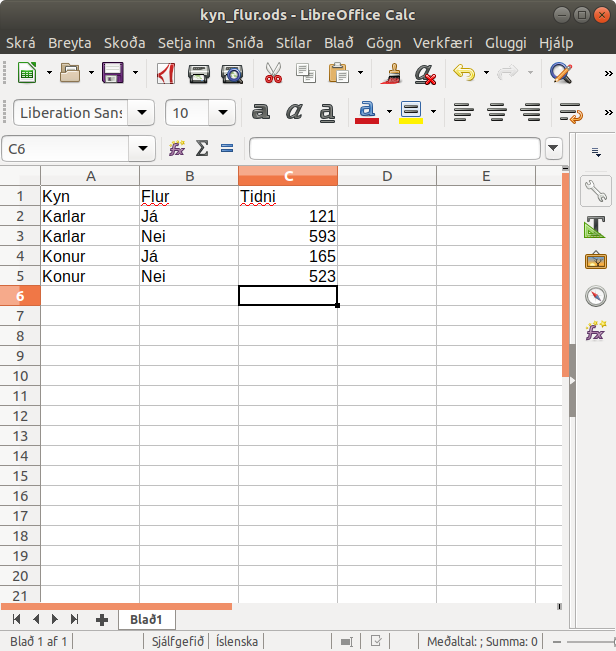
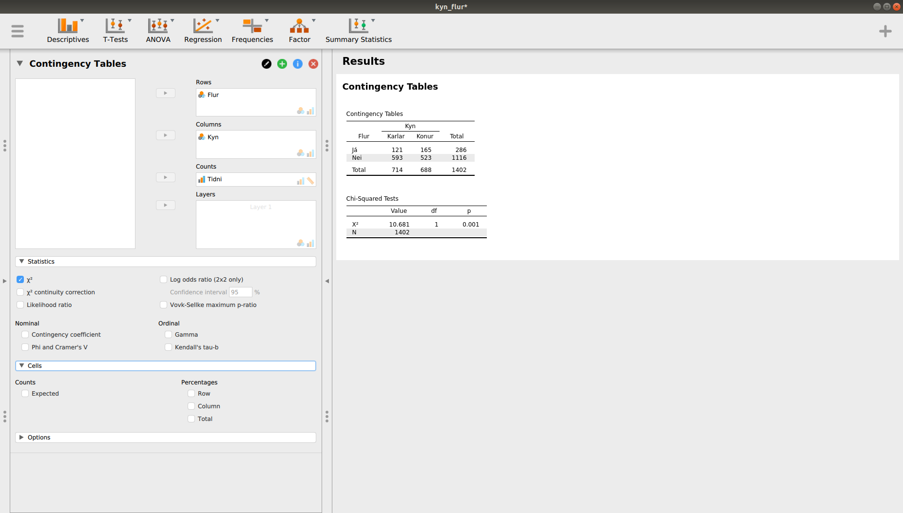

# Krosstöflur

## Helstu hugtök

**Flokkabreyta (categorical variable)**: Breyta þar sem gildi breytunnar segir eingöngu til um það hvaða flokki viðkomandi eining tilheyrir. Ekki er hægt að raða tölugildunum í merkingarbæra röð (eins og raðbreytur) eða vinna frekar með gildi þeirra á nokkurn hátt (eins og samfelldar breytur). Yfirleitt er um að ræða breytu sem getur aðeins tekið eitt gildi af föstu mengi gilda. 

**Tvíkostabreyta (binrary variable)**: Flokkabreyta sem tekur aðeins tvö gildi. Hefðbundið er að slíkar breytur taki gildin 0 og 1, þar sem einn táknar að viðkomandi hafi eiginleikann sem verið er að mæla en 0 táknar að viðkomandi hefur ekki tjéðan eiginleika. Til dæmis ef tívkosta breyta á að tákna kyn, þá getur 1 verið konur en 0 verið karlar. Þá mun meðaltal tvíkostabreytunnar vera til marks um hlutfall kvenna í gagnasafninu. 

**Krosstöflur (contingency tables)**: Töflur þar sem tvær flokkabreytur (categorical variables) eru krossaðar saman til að skoða tengslin á milli þeirra. Hér göngum við út frá því að látum gildi meintrar frumbreytu skilgreina dálka töflunnar en gildi fylgibreytunnar skilgreinir raðir töflunnar.

```{r, echo = FALSE, warning=FALSE, message=FALSE, tafla1}

tafla = data.frame("Y"=c("Y1","Y2","Samtals"),"X1"=c("Y1X1","Y2X1","X1n"),"X2"=c("Y1X2","Y2X2","X2n"),"Samtals"=c("Y1n","Y2n","n")  )

knitr::kable(tafla
             , digits = 2
             , caption = "2x2 krosstafla með tveimur tvíkostabreytum")

```

**Hólf (cells)**: Það sem taflan skiptist í. Tafla skiptist í jafnmörg hólf og er margfeldi gilda breytanna sem mynda krosstöfluna. Þannig er til dæmis 2x2 tafla með 4 hólf en 2x3 tafla er með 6 hólf. 

**Sameiginleg dreifing (joint distribution)**: Hlutfallið í hverju hólfi töflunnar, reiknað af heildarfjölda staka töflunnar. Þá erum við að skoða sameiginlega dreifingu breytanna tveggja sem eru í töflunni, það er hlutfall YX af N. Þá getum við sagt að ákveðið hlutfall sé bæði með eiginleikann x1 og með eiginleikann y1, af heildarfjölda. 

**Jaðardreifing (marginal distribution)**: Ysti dálkur og röð töflunnar þar sem fram kemur heildarfjöldi að baki hvorrar breytu fyrir sig. Er semsagt samanlögð tala allra gilda fyrir hvora breytu fyrir sig. Heildartölur fyrir hvora breytu fyrir sig. Líka hægt að segja að jaðardreifingin sé summa raða og dálka fyrir sameiginlega dreifingu (row and column totals for the joint distribution).  

**Skilyrt dreifing (conditional distribution)**: Þegar við skoðum hlutfallið fyrir hvert gildi frumbreytunnar fyrir sig, þá er það kallað skilyrt dreifing. Það er, við skoðum hlutfallið sem lendir í hverju hólfi hvort dálks fyrir sig af heildarfjölda mælinga í hvorum dálki. Þá gerist það einnig að heildarhlutfallið fyrir hvorn dálk fyrir sig verður 100%. Ef við skoðum skilyrta dreifingu þá getum við skoðað tengsl milli breytanna. Ef skilyrtar dreifingar eru eins, þá eru engin tengsl milli breytanna. 

**Rauntíðni (actual frequencies)**: Raunverulegu talningarnar í hólfum töflunnar. 

**Væntitíðni (expected frequencies)**: Fjöldi í hverju hólfi töflunnar ef hlutföllin væru þau sömu í öllum dálkum. Það, tíðnin ef engin tengsl væru milli breytanna. Formúlan er:  Væntitíðni = (heildartalning í röð*heildartalning í dálki)/n 

Í töflu þar sem eru tvær tvíkostabreytur þurfum við því að reikna væntitíðni fjórum sinnum.

  - $\frac{Y1n*X1n}{n}$
  - $\frac{Y1n*X21n}{n}$
  - $\frac{Y2n*X1n}{n}$
  - $\frac{Y2n*X2n}{n}$

**Leif (residual)**: Frávikið milli rauntíðni og væntitíðni. Getur bæði verið stöðluð og óstöðluð. Leifin er reiknuð fyrir hvert hólf töflunnar.

**Kí-kvaðrat prófið** veltur á samanburði rauntíðni og væntitíðni - það er, eru frávik rauðntíðni frá væntitíðni (sem er í raun núll-tengsl) nægilega mikil til að ganga út frá því að ólíklegt sé að gögnin komi úr þýði þar sem engin tengsl eru milli breytanna tveggja sem verið er að skoða. 

## Krosstöflur

Krosstöflur eða two way tables eru töflur þar sem birtar eru upplýsingar fyrir tvær flokkabreytur 


Svartir hringir - margins. 

Rauður hringur - joint distribution, þegar hlutfallið er skoðað fyrir hverja gagnarúðu töflunnar af heild töflunnar. 

Þegar við skoðum hlutfallið fyrir hverja röð eða hvern dálk, þá erum við að tala um marginal distribution. Þannig getum við til dæmis svarað því hversu hátt hlutfall 5-10 ára barna fékk gildið já, og hversu hátt hlutfall þeirra sem sögðu nei voru á aldrinum 5-10 ára. 

Nánari skilgreininar 

>**marginal distribution** of a subset of a collection of random variables is the probability distribution of the variables contained in the subset 
Úr <https://en.wikipedia.org/wiki/Marginal_distribution>  

>conditional distribution, which gives the probabilities contingent upon the values of the other variables. 
Úr <https://en.wikipedia.org/wiki/Marginal_distribution>  

## Krosstöflur - dæmi 1

Dæmið kemur úr frétt Gallup sem var birt á vef fyrirtækisins þann 22. janúar 2019: https://www.gallup.is/frettir/konur-frekar-med-hudflur-en-karlar/ 

Þar er sagt frá könnun sem fyrirtækið framkvæmdi í gegnum viðhorfahóp sinn (netpanel) þar sem meðal annars var spurt hvort viðkomandi væri með húðflúr. Í töflu \@ref(tab:tafla2) eru svörin, umreiknuð af undirrituðum.

Takið eftir því að við erum með kyn sem frumbreytu og því skilgreinir hún dálkana í töflunni. 

```{r, echo = FALSE, warning=FALSE, message=FALSE, tafla2}

tafla = data.frame("Húðflúr"=c("Já","Nei","Samtals"),"Karlar"=c("121","593","714"),"Konur"=c("165","523","688"),"Samtals"=c("286","1116","1402")  )

knitr::kable(tafla
             , digits = 2
             , caption = "Krosstafla, kyn og húðflúr")

```

Nokkrar spurningar:
 
 - Hver eru jaðardreifing (margins; marginal totals) töflunnar? 
    - Semsagt heildarfjöldi karla, 
    - Heildarfjöldi kvenna
    - Fjöldi með flúr
    - Fjöldi án flúrs 
 - Reiknið joint distribution fyrir töfluna
    - Hlutfall af hverri talningarsellu af heldarsummu eininga í töflunni
    - Kallað joint vegna þess að hlutfallið segir til um líkurnar á því að fá bæði tiltekið gildi á breytu 1 og á breytu 2. 
 - Reiknið loks conditional distribution fyrir töfluna.
    - Þar sem húðflúr er conditional á kyni 
    - $P(A|B) = \frac{P(A∩B)}{P(B)}$
        - Þar sem $(A∩B)$ eru líkurnar á því að atburður tilheyri bæði A og B
        - og þar sem $P(B)$ eru líkurnar á atburði B
        - Við getum sett þetta fram á eftirfarandi hátt:
            - $P(Tattoo|Female) = \frac{P(Tattoo∩Female)}{P(Female)}$
 - Líkurnar á því að atburður A gerist, að því gefnu að atburður B hafi þegar orðið er táknað með P(A|B) 
    - Conditional probability gefur okkur meiri upplýsingar heldur en aðeins að vita A 
      - P(A)=286/1402 
      - P(A|B)=165/688
  - Getum hugsað þetta svona:
    - Við viljum geta spáð fyrir um hvort tiltekinn einstaklingur er með tattoo eða ekki.
    - Án þess að vita neitt meira, þá segum við að líkurnar séu 20,4%
    - En, ef við vitum að einstaklingurinn er kona, þá hækka líkurnar hjá okkur í 24,0%
    - Það sem þetta segir okkur er að við erum með dependent events -> háðir atburðir, þar sem það að við vitum eitthvað um kyn einstaklingsins breytti líkunum á því að viðkomandi er með tattoo. Ef líkurnar hefðu ekki breyst neitt, þá væri um að ræða óháða atburði. 
    
```{r, echo = FALSE, warning=FALSE, message=FALSE, tafla3}

tafla = data.frame("Húðflúr"=c("Já","Nei","Samtals"),"Karlar"=c("8.6%","42.3%","50.9%"),"Konur"=c("11.8%","37.3%","49.1"),"Samtals"=c("20.4%","79.6%","100%")  )

knitr::kable(tafla
             , digits = 2
             , caption = "Krosstafla, kyn og húðflúr, joint distribution")

```

Hvað segir taflan með conditional distribution okkur (\@ref(tab:tafla4)) Að 16,9% karla var með húðflúr en 24% kvenna. 

Samtals dálkurinn segir okkur að við erum núna að vinna með hlutfallstölur fyrir karla annars vegar, og konur hins vegar.  

```{r, echo = FALSE, warning=FALSE, message=FALSE, tafla4}

tafla = data.frame("Húðflúr"=c("Já","Nei","Samtals"),"Karlar"=c("16.9%","83.1%","100%"),"Konur"=c("24.0%","76.0%","100%"))

knitr::kable(tafla
             , digits = 2
             , caption = "Krosstafla, kyn og húðflúr, conditional distribution")

```

## Krosstöflur - myndrænt - dæmi 1 

Tvær algengar leiðir til að skoða krosstöflur myndrænt eru 1) súlurit (bar chart eða bar graph); 2) Mosaic rit. 

### Dæmi um krossað súlurit.

```{r, echo = FALSE, warning=FALSE, message=FALSE, súlurit1}

library(ggplot2)

taflahlutf = data.frame("Kyn"=c("Karlar","Konur"),"Húðflúr"=c("Já","Já","Nei","Nei"),"Hlutfall"=c(0.169,0.24,0.831,0.76))

# Change the colors manually
p <- ggplot(data=taflahlutf, aes(x=Kyn, y=Hlutfall, fill=Húðflúr)) +
geom_bar(stat="identity", color="black", position=position_dodge())+
  theme_minimal()
# Use custom colors
p + scale_fill_manual(values=c('#E69F00','#999999'))


```


```{r, echo = FALSE, warning=FALSE, message=FALSE, súlurit2}

taflahlutf = data.frame("Kyn"=c("Karlar","Konur"),"Húðflúr"=c("Já","Já","Nei","Nei"),"Fjöldi"=c(121,165,593,523))

# Change the colors manually
p <- ggplot(data=taflahlutf, aes(x=Kyn, y=Fjöldi, fill=Húðflúr)) +
geom_bar(stat="identity", color="black", position=position_dodge())+
  theme_minimal()
# Use custom colors
p + scale_fill_manual(values=c('#E69F00','#999999'))


```

### Dæmi um mosaic rit

Mosaic rit verða áhugaverðari eftir því sem breyturnar verða margskiptari.

```{r, echo = FALSE, warning=FALSE, message=FALSE, mosaicrit}

library(ggmosaic)

ggplot(data=taflahlutf) +
  geom_mosaic(aes(weight=Fjöldi, x=product(Kyn), fill=Húðflúr)) +
  labs(x="Kyn") 


```

## Krosstöflur - dæmi 2

Við tökum annað dæmi. Hér eru við með gögn frá bandarísku vinnumálatölfræðistofnunni (U.S. Bureau of Labour Statistics). Í gögnunum má sjá fjölda eftir menntunarstigi og stöðu á vinnumarkaði fyrir alla bandaríkjamenn sem eru 25 ára eða eldri fyrir fjórða ársfjórðung 2019. Í töflu \@ref(tab:tafla5) sjáum við gögnin. Takið eftir að tölugildi fyrir þá sem hafa ekkert háskólapróf og eru utan vinnumarkaðar er ekki gefið upp af eiganda gagnanna og er því metið (ónákvæmlega) af undirrituðum. Allar tölur eru í þúsundum.

Hér erum við með tvær þrískiptar breytur
 
 - menntun
    - ekkert háskólapróf
    - bakkalársgráða
    - framhaldsgráða
 - Vinnumarkaðsstaða
    - Starfandi
    - Atvinnulausir
    - Utan vinnumarkaðar


```{r, echo = FALSE, warning=FALSE, message=FALSE, tafla5}

tafla = data.frame("Menntun"=c("Ekkert háskólapróf","Bakkalárspróf","Framhaldspróf"),"Starfandi"=c("34908","36511","22369"),"Atvinnulausir"=c("1292","725","390"),"Utan vinnumarkaðar"=c("26102","13403","7661")  )

knitr::kable(tafla
             , digits = 2
             , caption = "Krosstafla, vinnumarkaðsstaða eftir menntunarstigi")

```

Verkefnið er: 

  1) Hvernig myndum við setja upp töflu með þessum upplýsingum? 
  2) Setjum gildin inn í töfluna (getum til dæmis notað excel til þess) 
  3) Hver er jaðardreifing töflunnar? 
     a) Hvernig túlkum við hana? 
     b) Er eitthvað sérstaklega áhugavert þarna að sjá? 
  4) Hver er sameiginleg dreifing breytanna? 
     a) Hvernig túlkum við hana? 
     b) Er eitthvað sérstaklega áhugavert þarna að sjá? 
  5) Fyrir hvora breytuna viljum við reikna skilyrta dreifingu? Hver er skilyrt dreifing? 
     a) Hvernig túlkum við skilyrtu dreifinguna? 
     b) Er eitthvað áhugavert í þessum niðurstöðum? 
     c) Eru líkur á því að tengsl séu til staðar milli þessara breyta? 
  6) Teiknum súlurit 
     a) Mjööööög einfalt ef við höfum sett töfluna rétt upp í excel. Og þá getum við einnig fylgt dæmi GBA eins og það er á glærunum og notað talningar í stað hlutfalla (eða prósenta).

## Tölfræðilega óháðar breytur

Agresti segir þetta vel: 

>"Two categorcial variables X and Y that are both response variables are said to be statistically independent if all their joint probabilities equal the product of their marginal probabilities (pp. 28)." 

Við erum hins vegar oftast að hugsa þetta þannig að X er frumbreyta og Y er fylgibreyta. Þá segir Agresti: 

>"When Y is a response variable and X is explanatory, it is more relevant to analyze the conditional distribution of Y given X. The variables are there said to be statistically independent if the true conditional distributions of Y are identical at each level of X. Statistical independence is then also referred to as homogeneity of the conditional distributions. When the variables are independent, the probability of any particular column outcome j is the same in each row (pp.28)." 

Einsleitni skilyrtu dreifingarinnar 

Hjálpar okkur að svara spurningunni hvort munur sem við sjáum á háðu hlutfalli tveggja hópa sé líklega kominn til af handahófskenndum ástæðum. Nánar til tekið, ef enginn munur er á hópunum í þýði, hversu líklegt væri að fá mun af því tagi sem við sjáum í úrtaki okkar (eða stærri).

## Kíkvaðrat, útreikningar 

  1. Fyrsta skrefið er að reikna háða dreifingu miðað við rannsóknarspurninguna okkar. 
  2. Reikna væntitíðni fyrir hvert hólf töflunnar 
    a. Væntitíðnin segir til um hvernig tengsl breytanna myndu vera ef um væri að ræða óháðar breytur. Þess vegna sjáum við að háð hlutfall væntitíðni er alltaf það sama ef við skoðum skilyrta dreifingu væntitíðninar og ennfremur, er hún sama gildið og hlutfall jaðardreifingarinnar. Það er, við það að vita hvort einstaklingur tilheyri hópi 1 eða 2 á breytunni X hefur engin áhrif á forspá okkar um Y. 
    b. Formúla fyrir væntitíðni: E = (R*C)/n 
       Þar sem E er væntitíðni 
       R er summan fyrir raðir töflunar 
       C er summan fyrir dálka töflunnar 
       n er heildarsumma töflunnar 
3. Bera saman væntigildi og raungildi og reikna kíkvaðrat gildi þar sem þessi samanburður er summaður upp fyrir alla töfluna. Hérna erum við semsagt að kanna hversu langt frá væntitíðninni raungildin í töflunni eru. Til að svara spurningunni, er líklegt að fá svona niðurstöður úr þýði þar sem engin tengsl eru milli breytanna. Þá erum við að skoða muninn á dreifingunni sem við erum með í úrtakinu á móti dreifingu þar sem engin tengsl eru til staðar. 
    a. Formúlan fyrir kíkvaðrat gildið: $\sum=\frac{O-E^2}{E}$
    Þar sem O er rauntíðni (observed count) 
    E er væntitíðni (sjá lið 1 hér að ofan) 
4. Kíkvaðrat gildið er útkoman úr lið 3 
5. Reikna frígráður samkvæmt formúlu 
    a. Formúlan fyrir frígráður kíkvaðratprófs er: df = (r - 1)(c - 1)
    Þar sem r er fjöldi raða í töflunni 
    C er fjöldi dálka í töflunni 
6. Fletta upp kíkvaðratgildi í kíkvaðrat töflu út frá liðum 3 og 4. Hana má til dæmis finna í bókinni okkar eða á vefnum.  
7. Þegar við skrifum niðurstöður kíkvaðrat prófs í niðurstöðukafla er það á þennan hátt: 

>Χ2 ([df], N = [fjöldi]) = [kí], p <.[líkur á þessum eða sterkari tengslum þegar engin eru til staðar í þýði] 

## Kíkvaðrat dæmi 1 

Reiknum kíkvaðrat í höndunum fyrir tengsl kyns og húðflúrs. 

1. Reikna væntitíðni fyrir hvert hólf töflunnar
   a. Formúla fyrir væntitíðni: E = (R*C)/n 
   b. (286*714)/1402=145,6519 
   c. (286*688)/1402=140,3481 
   d. (714*1116)/1402=568,3481 
   e. (688*1116)/1402=547,6519 


```{r, echo = FALSE, warning=FALSE, message=FALSE, tafla6}

tafla = data.frame("Flúr"=c("Flúr","Ekki flúr"),"Karlar"=c("145.65","568.35"),"Konur"=c("140.35","547.65")  )

knitr::kable(tafla
             , digits = 2
             , caption = "Væntitíðni húðflúrs og kyns")

```

2. Bera saman væntigildi og raungildi og reikna kíkvaðrat gildi þar sem þessi samanburður er summaður upp fyrir alla töfluna
   a. Formúlan fyrir kíkvaðrat gildið: $\sum=\frac{O-E^2}{E}$
   b. ((121-145,65)^2)/145,65=4,1718
   c. ((165-140,35)^2)/140,35=4,3293 
   d. ((593-568,35)^2)/568,35=1,0691 
   e. ((523-547,65)^2)/547,65=1,1095 
   f. 4,1718+4,3293+1,0691+1,1095=10,6797   

3. Kíkvaðrat gildið er útkoman úr lið 2: 10,6797 

4. Reikna frígráður samkvæmt formúlu
   a. Formúlan fyrir frígráður kíkvaðratprófs er: df = (r - 1)(c - 1)
   b. df = 1 

5. Fletta upp kíkvaðratgildi í kíkvaðrat töflu út frá liðum 3 og 4.
   a. Hana má til dæmis finna í bókinni okkar eða á vefnum.
   b. Við dettum á milli 0,0025 og 0,001
   c. Samkvæmt uppflettingu í R er nákvæmt p gildi 0,001083176

6. Þegar við skrifum niðurstöður kíkvaðrat prófs í niðurstöðukafla er það á þennan hátt: 
   a. Χ2 ([df], N = [fjöldi]) = [kí], p <.[líkur á þessum eða sterkari tengslum þegar engin eru til staðar í þýði] 
   b. Í okkar tilfelli væri því niðurstaðan: $\chi^2$(1, N = 1402) = 10,7, p = 0,001 

## Forsendur kí kvaðrats

1. Óháðar mælingar 
   a. hvert og eitt stak mælt einu sinni 
   b. hvert og eitt stak tilheyrir einum og aðeins einum hópi í gögnunum 
2. Mælingar byggjast á tíðni 
   a. t.d. ekki meðaltöl samfelldra breyta 
3. Nægilega stórt úrtak - sem þýðir að 
   a. Væntitíðni þarf að vera 1,0 eða hærri í öllum hólfum töflunnar 
   b. Væntitíðni verður að vera lægri en 5 í mest 20% hólfanna 
      i. Í bókinni er gengið lengra og gert ráð fyrir að í 2x2 töflum verði væntitíðni í öllum hólfum að vera 5 eða hærri 

Hvað er til bragðs að taka ef forsendur eru ekki uppfylltar? 

1. Ef mælingar eru ekki óháðar þá þarf annað hvort að setja upp nýja rannsókn/tilraun eða finna aðferð sem ræður við tilraunasnið af þessari tegund. Sjálfur þekki ég ekki svoleiðis aðferð. 
2. Ef mælingar byggjast ekki á tíðni eða talningum þá er nærtækast að beita t-prófi eða z-prófi, ef um er að ræða tvö meðtöl sem verið er að bera saman. Annars dreifigreiningu (ANOVA). 
3. Ef úrtakið er ekki nógu stórt gæti verið annars vegar mögulegt að: 
   a. Safna meira af gögnum úr sama þýði 
   b. Sameina gildi breytunnar til að fá nægilega háa væntitíðni 
   c. Fishers exact test er stundum notað þegar talningar eru mjög litlar. Það er hægt að reikna í Jasp undir log odd ratio.

## Kí-kvaðrat dæmi 2

Prófum að reikna kí-kvaðrat í JASP.

> Það er gert með því að Velja frequencies -> Contingency tables -> Setja viðeigandi breytur í raðir og dálka
Þá fáum við niðurstöðurnar vinstra megin í forritið - það er, átpútið.
Í JASP er einnig hægt að velja milli mismunandi tegundir prófa ef forsendur kí-kvaðrats eru ekki uppfylltar.

Við getum slegið gögnin okkar um tengsl milli kyns og húðflúrana í töflureikni og vistað sem odt skrá. 

 

Svo lesum við þau gögn í JASP og reiknum kí-kvaðrat. Takið eftir að hér erum við að vinna með tilbúna krosstöflu en við gætum allt eins verið með hrágögnin. Í þeim tilvikum þurfum við ekki að hugsa um *counts* dálkinn í jasp.

 

### Dæmi

Við skulum prófa að slá neðangreinda kross-töflu í Jasp og reikna kí-kvaðrat:

```{r, echo = FALSE, warning=FALSE, message=FALSE, tafla61}

tafla = data.frame("Bati"=c("Bati","Enginn bati"),"Lyfleysa"=c("8","7"),"Lyf"=c("14","1")  )

knitr::kable(tafla
             , digits = 2
             , caption = "Væntitíðni húðflúrs og kyns")

```

## Sambandið milli kí og z

Ef við horfum á aðra breytuna í töflunni okkar sem "successess" þá getum við líka reiknað z-próf, two sample z-test. Samkvæmt bókinni ættu báðar þessara aðferða (það er, kíkvaðrat og z-próf fyrir tvö hlutföll) að gefa okkur nákvæmlega sömu niðurstöðuna. Kosturinn við z-prófið er sá að þar getum við prófað einhliða og tvíhliða tilgátur. Kosturinn við kí-kvaðrat er að þar erum við ekki bundin af því að vera með tvo hópa, heldur getum reiknað niðurstöðu prófsins fyrir stærri krosstöflur en bara 2x2. 

Prófum það! 

Við höfum þegar reiknað niðurstöður fyrir það hvort munur sé milli karla og kvenna hvað varðar húðflúr: 

$\chi^2$(1, N = 1402) = 10,7, p = 0,001 

Ef við prófum að reikna z-próf fyrir tvo hópa: 

1. Við ætlum að prófa tilgátuna að p1 = p2 (þetta er semsé núlltilgátan)
2. Fyrst reiknum við pooled estimate fyrir common value fyrir p1 og p2
   a. $\hat{p}=\frac{X_1+X_2}{n_1+n_2}$
3. Svo reiknum við pooled standard error 
   a. $SE_Dp=\sqrt{\hat{p}(1-\hat{p})\frac{1}{n_1}+\frac{1}{n_2}}$
4. $z=\frac{\hat{p_1}-\hat{p_2}}{SE_Dp}$
          
Niðurstöður þessara æfinga eru byggðar á normal approximation og því getum við flett niðurstöðunni upp í normaldreifingartöflu. 

Notum sama dæmið og áðan. 

1. P-hattur er 0,204
   a. $\hat{p}=\frac{121+165}{714+688}$
2. $SE_Dp$ er 0,0215
   a. $SE_Dp=\sqrt{0.204(1-0.204)\frac{1}{714}+\frac{1}{688}}$
3. Z-gildið er -3,27 
   a. $z=\frac{0.1695-0.2398}{0.0215}$
4. Ef við flettum þessu upp í töflu með stöðluðum normalgildum þá fáum við gildið 0.9999793
   a. Ef við vorum með tvíhliða tilgátu þá:
      i. 2*pnorm(1-zgildi) = 0,001082171 

Þannig að: 16,9% karla og 24% kvenna eru með húðflúr. Munurinn er tölfræðilega marktækur (z=-3,27, p = 0,001. 

## Kí-kvaðrat dreifingin

Almennt um kí-kvaðrat dreifinguna: 

  - Fjölskylda af dreifingum, rétt eins og t-dreifingin.  
  - Einn parametri - frígráður. Meðtal dreifingarinnar eru frígráðurnar. 
  - Eftir því sem frígráðum fjölgar, því samhverfari verður dreifingin, sjá mynd \@ref(fig:kikv1).
    - Því fleiri sem frígráður eru, þeim mun nær normaldreifingu er dreifingin. 
    - Eftir því sem k nálgast óendanleika, þeim mun meira líkist dreifingin normaldreifingu 
  - Hún er alltaf hærri en 0. 

Mikilvægt hugtak er þéttni (density). Þéttni segir til um líkindi þess að gildi tiltekinnar random breytu myndi taka ákveðið gildi úr dreifingu breytunnar. Oft er þéttni notuð til að skoða hlutfallið sem fellur undir ákveðið svæði dreifingarinnar, það er, ákveðið róf gilda. Til dæmis getum við skoðað líkindi þess að tiltekin breyta sem er normaldreifð taki gildi á bilinu -2 til +2 þar sem um er að ræða normaldreifingu með meðaltalinu 0 og staðalfrávikinu 1 <- 95.4% 

  - En milli 0.5 og 1? Ca. 15% 
  - En milli 0 og 1? Ca. 34% 
  - En yfir 3? Ca.1% 
  - En yfir 1,96 eða undir -1,95? Ca. 5%
  
```{r, echo = FALSE, warning=FALSE, message=FALSE, kikv1, fig.cap = "Kíkvaðrat dreifingin eftir fjölda frígráða"}

library(ggplot2)

pl = ggplot(data.frame(x = c(0, 50)), aes(x = x)) +
  stat_function(fun = dchisq, args = list(df = 1), aes(colour = "df=01"), size=1.2)+
  stat_function(fun = dchisq, args = list(df = 3), aes(colour = "df=03"), size=1.2) +
  stat_function(fun = dchisq, args = list(df = 6), aes(colour = "df=06"), size=1.2) +
  stat_function(fun = dchisq, args = list(df = 10), aes(colour = "df=10"), size=1.2) +
  stat_function(fun = dchisq, args = list(df = 15), aes(colour = "df=15"), size=1.2) +
  stat_function(fun = dchisq, args = list(df = 25), aes(colour = "df=25"), size=1.2) +
  scale_colour_manual("Fjöldi frígráða", values = c("pink", "red", "dark red", "light blue","blue","dark blue"))+
  #ggtitle("Kíkvaðrat dreifingin eftir fjölda frígráða") +
  xlab("Kí-kvaðrat") + ylab("Hlutfall")
 
pl 
# ggplot(data.frame(x = c(-5, 5)), aes(x = x)) +
#   stat_function(fun = dnorm, args = list(mean=0, sd=2), aes(colour = "df=01"), size=1.2)+
#   scale_colour_manual("Fjöldi frígráða", values = c("pink"))

```


Ef við skoðum kíkvaðrat dreifinguna fyrir mismunandi frígráður (sjá mynd \@ref(fig:kikv2)) þá sjáum við fljótt hversu stórt kíkvaðrat gildi úr prófinu við þurfum til að ná fram tölfræðilega marktækum tengslum breytanna.  

```{r, echo = FALSE, warning=FALSE, message=FALSE, kikv2, fig.cap="Uppsöfnuð kíkvaðrat dreifing eftir fjölda frígráða"}

pchisq_p <- function(q, df, ncp = 0, lower.tail = TRUE, log.p = FALSE)
{
  return(1-pchisq(q, df, ncp = 0, lower.tail = TRUE, log.p = FALSE))
}

pl2 = ggplot(data.frame(x = c(0, 50)), aes(x = x)) +
  stat_function(fun = pchisq_p, args = list(df = 1), aes(colour = "df=01"), size=1.2) +
  stat_function(fun = pchisq_p, args = list(df = 3), aes(colour = "df=03"), size=1.2) +
  stat_function(fun = pchisq_p, args = list(df = 6), aes(colour = "df=06"), size=1.2) +
  stat_function(fun = pchisq_p, args = list(df = 10), aes(colour = "df=10"), size=1.2) +
  stat_function(fun = pchisq_p, args = list(df = 15), aes(colour = "df=15"), size=1.2) +
  stat_function(fun = pchisq_p, args = list(df = 25), aes(colour = "df=25"), size=1.2) +
  scale_colour_manual("Fjöldi frígráða", values = c("pink", "red", "dark red", "light blue","blue","dark blue"))+
  #ggtitle("Kíkvaðrat dreifingin eftir fjölda frígráða") +
  xlab("Uppsafnað (cumulative) Kí-kvaðrat") + ylab("p-gildi")+ 
  geom_hline(yintercept=.05, linetype="dashed", 
             color = "green", size=.8)

pl2


```


Til dæmis dugar kíkvaðrat gildi upp á 10 til að ná fram tölfræðilegri marktekt ef um er að ræða frígráður á bilinu 1 - 3. Uppfletting í kíkvaðrat töflunni (sem til dæmis má finna á innri kápu bókarinnar) staðfestir það.  

Til dæmis: 

 - $\chi^2$=10,83, með einni frígráðu gefur p-gildið 0,001 
 - $\chi^2$=9,21, með tveimur frígráðum gefur p-gildið 0,01 
 - $\chi^2$=10, með þremur frígráðum gefur p-gildið 0,01856 (gildin 7,81 gefur p=0,05 og 11,34 gefur 0,01) 

Kíkvaðrat er notað fyrir fleira en til að meta marktæk tengsl í krosstöflu. Prófið er einnig notað til að meta mátgæði líkana. Þá telst marktækt kíkvaðratpróf vera til marks um að líkanið passi ekki vel við gögnin. 

F-dreifingin (sem er notuð í ANOVA) dreifist einnig í samræmi við kí-kvaðrat dreifinguna, en þá er um að ræða hlutfallið á milli tveggja óháðra kíkvaðrat random breyta sem búið er að deila með frígráðum hvorrar um sig. 

Z- gildið í öðru veldi er jafnt og kí-kvaðrat gildið- > 10,7!! 

## Kí-kvaðrat leif

Leifin í kí-kvaðrat er munurinn milli raungilda og væntitíðni. Með henni er hægt að sjá hvar mest munar á milli þessara tveggja gilda - og segir þá til um hvaða hólf töflunnar hefur mest að segja fyrir niðurstöðu kíkvaðrat prófsins. 

Hægt er að nota leifina til að aðstoða við frekari túlkun á niðurstöðum marktæks kíkvaðrat prófs. 

Leifin er einfaldlega munurinn á milli raunverulegu mælingarinnar og væntitíðni fyrir hvert hólf töflunnar. Óstöðluð leif er því = O-E 

Stöðluð leif er fundin með því að deila í óstöðluðu leifina með kvaðratrót væntigildisins.  

  - Staðlaða leifin virkar eins og hver önnur stöðuluð breyta, með meðaltalið 0 og staðalfrávikið 1.  
  - Stöðluð leif (rétt eins og leifin sjálf) er reiknuð fyrir hvert hólf töflunnar 
  - Staðlaða leifin segir okkur til um hversu mikið hvert og eitt hólf töflunnar hefur á útreikninga kí-kvaðrat gildisins.  
  - Stöðluð leif getur til að mynda hjálpað okkur við að túlka tölfræðilega marktæk kíkvaðrat próf þar sem hún segir okkur hvaða hólf töflunnar höfðu mest áhrif á að kíkvaðrat gildið varð marktækt. 
  - Til eru ágætis þumalfingursreglur um túlkun staðlaðrar leifar: 
    - Ef hún liggur utan við plús eða mínus 2 þá er hægt að ganga út frá því að viðkomandi hólf hafi mikil áhrif á niðurstöðu kíkvaðrat prófsins. 
    - Ef hún er innan plús mínus 2 þá hefur viðkomandi hólf töflunnar veik áhrif á niðurstöðu kíkvaðrat prófsins. 

## Túlkun

Eins og við munum gengur kí-kvaðrat prófið alltaf út frá núlltilgátunni að engin tengsl séu til staðar í krosstöflunni sem við er að skoða. Marktækt próf er þá til marks um núlltilgátunni sé hafnað vegna þess að svo ólíklegt er að fá tengsl af þessum styrkleika (eða sterkari) úr þýði þar sem engin tengsl eru til staðar. 
Túlkun niðurstaðna þarf að taka mið af því hvernig gögn rannsóknarinnar eru fengin: 

1. Þegar frumbreytan skilgreinir tvö mismunandi þýði. Engin tengsl koma þá þannig fram að skilyrt dreifing er sú sama fyrir öll gildi frumbreytunnar.  
   a. Dæmi um þetta eru tilraunaaðstæður þar sem hópnum er skipt í tvennt (eða fleiri hópa) og hver hópur fær mismunandi inngrip. Þá er eðlilegt að skoða hvort um er að ræða sömu skiptinguna hjá hópunum og láta það ráða túlkun niðurstaðna. Hér er lykilatriðið að gildi frumbreytunnar hjá hverjum og einum einstaklingi er ákvarðað. 
      i. Guðmundur tekur dæmið um vínsölu eftir tegund tónlistar. 
      ii. Annað dæmi gæti verið hver önnur tilraun þar sem fylgibreytan er mæld á nafnkvarða. Til dæmis hvort mismunandi aðferðir við þunglyndismeðferð skili því að þunglyndiseinkenni minnki, standi í stað eða aukist. 

2. Þegar tvær breytur eru mældar í einu og sama þýðinu. Engin tengsl fela þá í sér að breyturnar tvær eru innbyrðis óháðar. Hér eru breyturnar tvær mældar, en ekki ákvarðaðar. Þá er oft eðlilegt að skoða hvort breyturnar séu innbyrðis óháðar (engin tengsl).
   a. Dæmi um þetta eru þau tilvik þar sem við erum með gagnasett sem ekki eru byggð á tilraunum heldur mælingum á náttúrulegum hópum. 
      i. GBA tekur dæmi um hvort karlar og konur detti í það eða ekki. En þetta er þó flóknarar en svo og einnig er mögulegt að líta á karla og konur sem óháð þýði og þá er hægt að skoða skilyrta dreifni út frá kyni. 
      ii. Annað dæmi gæti verið tengsl milli tegundar slysa og hvenær dagsins þau gerast. Bæði eru mældar breytur og niðurstaða kíkvaðrat prófsins er hugsanlega frekar til marks um tengsl breytanna tveggja en ekki út frá skilyrtri dreifingu þeirra. 

Bókin segir: 

Ef engin skýr greinarmunur er gerður milli skýribreytu og háðri breytu í krosstöflu þá göngum við út frá því að við séum að skoða tengslin milli breytanna. Ef við erum hins vegar með það skýrt sett upp að önnur breytan er frumbreyta og hin breytan er fylgibreyta, þá berum við saman háða dreifingu á grunni frumbreytunnar og túlkum niðurstöðurnar þannig. Ef við erum ekki með skýra hugmynd um hvor sé frumbreyta og hvor sé fylgibreyta, þá reynum við einfaldlega að meta tengsl milli breytanna og þá getur jafnvel komið til álita að skoða háða dreifingu byggða á báðum breytum krosstöflunnar. Þá erum við með niðurstöður sem við túlkum einhvern veginn á þá vegu að um sé að ræða það sterk tengsl milli breytanna að ólíklegt er að þau hafi komið til vegna tilviljunar 

Bókin segir líka: 

Tvö mismunandi líkön geta búið til gögn fyrir r x c töflur sem leiða til kíkvaðrat prófsins.  

Í fyrra líkaninu þá eru óháð SRS dregin úr hverju c-þýðinu og hver observation er flokkuð í samræmi við flokkabreytu sem er með r-mögulegum gildum. Núlltilgátan er þá að dreifing flokkabreytunnar í röðunum sé hin sama fyrir öll c þýðin.  

Í seinna líkaninu er eitt SRS dregið úr þýði og observations eru flokkaðar í samræmi við tvær flokkabreytur sem hafa r og c möguleg gildi. Í þessu líkani segir núlltilgátan að breyturnar sem skilgreina raðir og dálka séu óháðar. 

## Goodness-of-fit 

Fyrir utan að reikna kíkvaðrat til að bera saman drieingu flokkabreytu í c-þýðum, þá er einnig hægt að nota kíkvaðrat til að bera saman úrtak úr tilteknu þýði við hypothesized dreifingu. 

Þá getum við til dæmis skoðað hvort tiltekin talning sé í samræmi við dreifingu sem segir til um að viðkomandi talning komi til af hendingu. 

Þá erum við að vinna með one-way töflu þar sem við erum með talning fyrir ákveðna breytu. Núlltilgátan okkar er að dreifing þessarar talningar sé í samræmi við ákveðna dreifingu - ef prófið er marktækt þá bendir það til að dreifingin sé önnur en sú sem við höfðum í huga. 

Framkvæmdin er mjög svipuð og þegar unnið er með kíkvaðrat próf út frá krosstöflu: 

  - gögn fyrir n mælingar (observations) fyrir flokkabreytu með k mögulegum flokkum (outcomes) eru summeruð sem mældar talningar (observed counts) n1, n2,...nk, í k hólfum. 
  - Núlltilgátan skilgreinir líkurnar p1, p2,...pk fyrir mögulegum flokkum (possible outcomes) 
  - Aðaltilgátan segir að hin sönnu líkindi fyrir possible ouctomes eru ekki líkindin sem eru tilgreind samkvæmt núlltilgátunni. 
  - Fyrir hvert hólf töflunnar, margfaldaðu heildarfjölda mælinga n með tilgreindum líkindum til að ákvarða væntitíðni 
    - Væntitíðni = $np_i$
  - Kíkvaðrat gildið mælir að hvaða marki mældu talningar hólfanna eru mismunandi en væntitíðni töfluhólfanna. Formúlan er:
    - $\sum=\frac{O-E^2}{E}$
    - Þar sem o er rauntíðnin 
    - Og e er væntitíðni viðkomandi hólfs 
  - Frígráðurnar eru k-1 og p gildi eru reiknuð út frá kíkvaðrat dreifingunni
  - M&M mæla með að nota þessa aðferð þegar væntitíðni í hverju hólfi er 5 eða hærri 

M&M taka nokkur dæmi um hvernig sé hægt að hagnýta þetta ágæta próf: 

  - könnun var lögð fyrir í 6 ríkjum bandaríkjanna. Mikið var skrifað af opnum svörum og því eðlilegt að greina þau frekar. Sökum kostnaðar þótti ekki fýsilegt að greina þau öll og því var kerfisbundið úrtak valið þar sem svarblað 10 hvers svaranda var valið og það greint. En til að kanna hvort úrtakið væri bjagað (til dæmis vissu menn ekki hvernig útfylltum spurningalistum var raðað) er hægt að kanna hvort hlutfall spurningalista sem valdir voru í úrtakið, eftir ríkjum könnunarinnar væri það sama og raunverulegt hlutfall úrtaksins eftir mismunandi ríkjunum. Það er að segja, er dreifing þeirra opinna svara sem voru valin, hin sama og dreifing úrtaksins. 
  - dreifing lita M&M í plain chocolate candies pokum. Þá er unnið út frá því að M&M fyrirtækið birtir ákveðnar prósentur fyrir dreifingu lita í pokunum. Þegar þú opnar tiltekinn poka af M&M og telur litina - er dreifingin önnur heldur en hin auglýsta dreifing. 
  - þeir taka líka dæmi um að sjúklingar á deild fyrir heilabilaða séu frekar árásargjarnir/hættulegir þegar fullt tungl er, heldur en þegar tungl er ekki fullt. 


